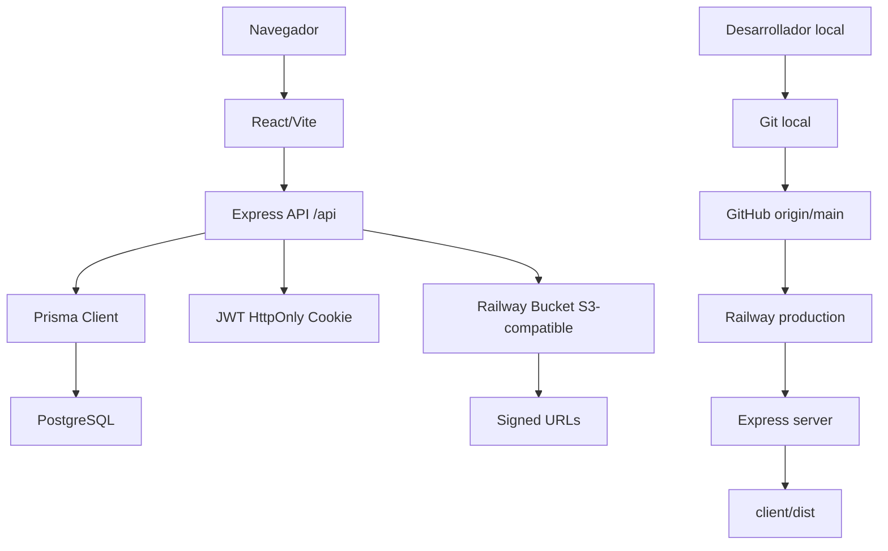

# Arquitectura

## Vista general

Sunpartners SaaS es una aplicacion full stack desplegada como un servicio Node.js en Railway.

## Frontend

Ubicacion: `client/`

Tecnologias:

- React.
- Vite.
- React Router.
- Axios.
- Tailwind CSS.
- Componentes UI locales.

Rutas principales:

- `/login`
- `/`
- `/inventario`
- `/comercial`
- `/clientes`
- `/cotizaciones`
- `/cotizaciones/nueva`
- `/cotizaciones/:id`
- `/cotizaciones/:id/planeador`
- `/tasks`
- `/perfil`
- `/equipo`
- `/q/:hash` para cotizacion publica.

En desarrollo, Vite proxya `/api` a `http://localhost:3001`.

## Backend

Ubicacion: `server/`

Tecnologias:

- Express.
- Prisma.
- PostgreSQL.
- JWT.
- HttpOnly cookies.
- Bcrypt.
- AWS SDK S3-compatible.
- Multer para uploads.

Rutas API:

- `/api/auth`
- `/api/inventory`
- `/api/clients`
- `/api/quotations`
- `/api/users`
- `/api/tasks`
- `/api/announcements`
- `/api/settings`
- `/health`

En produccion, Express tambien sirve `client/dist`.

## Base de datos

La base de datos es PostgreSQL. Prisma esta configurado en `server/prisma/schema.prisma`.

Modelos importantes:

- `User`
- `Client`
- `ClientContact`
- `Inventory_Bodega`
- `Inventory_Commercial`
- `Quotation`
- `QuotationItem`
- `QuotationService`
- `PlanningStep`
- `Task`
- `Announcement`
- `InventoryAlert`

## Doble inventario

El proyecto usa dos tablas de inventario:

- `Inventory_Bodega`: fuente de verdad para stock fisico y costos internos.
- `Inventory_Commercial`: catalogo comercial, nombres comerciales y precios de alquiler.

La sincronizacion se ejecuta en `server/src/db.js` mediante extensiones de Prisma.

## Storage

El storage usa API S3-compatible por medio de AWS SDK. En Railway el bucket visible es `ordenes-sunp`.

Usos actuales:

- fotos de perfil;
- ordenes de compra;
- signed URLs temporales para acceso privado.
